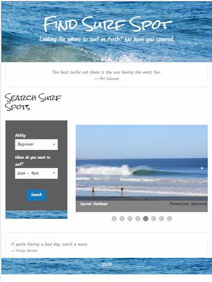

# Find Surf Spot
A web application that uses Willy Weather API to recommend the best surf sports in the Perth metropolitan area. It uses Foundation CSS Framework and JQuery.

## Description
Forecast Websites are difficult to interpret and read. It is difficult to know where the best place to surf will be, based on the conditions and a person's surfing ability. Thus a web application that uses Willy Weather API to recommend best surf sports in the Perth metropolitan area has been developed.

## Table of Contents

1. [User Story](#User-Story)
2. [Acceptance Criteria](#Acceptance-Criteria)
3. [Installation](#Installation)
4. [APIs used](#APIs-used)
5. [Technologies used](#Technologies-used)
6. [Breakdown of roles](#Breakdown-of-roles)
7. [Challenges](#Challenges)
8. [Successes](#Successes)
9. [Usage](#Usage)
10. [Directions for Future Development](#directions-for-future-development)
11. [Credits](#Credits)
12. [Licence](#License)
13. [Authors](#Authors)

## User Story 

```
AS A user wanting to surf
I WANT to search for the best surf spots
So that I can plan where to surf depending on the weather conditions and my ability
```

## Acceptance Criteria

```
GIVEN I am using the **Find Surf Spot** application to refer me to a beach location
WHEN I first arrive at the webpage, I select my level of ability.
THEN I choose when I want to surf: 6-9am, 11-2pm or 3-6pm.
WHEN I click search,
THEN I am shown a list of suitable surf spots based on their proximity to me.
WHEN I click on a surf spot in the list
THEN I am presented with the following information about that spot:

- Location and map of the surfspot 
- Coastal weather warnings (if any)
- Swell size
- Swell direction 
- Wind direction and strength 
- Weather conditions (temperature, UV index)
- Tide times
- Sunrise/sunset times
- Google map of beach location
```

## Installation

### APIs used 
- Willy Weather Warnings API
- Willy Weather Forecasts API 
- Google Maps Embed API

### Technologies used 
- HTML
- JQuery
- AJAX
- Foundation CSS Framework
- Agile software development (Kanban)

### Breakdown of roles
#### Jo (Chief Technical Officer)
- Code architecture - on click events to store user responses, conditonal statements, select locations based on date (i.e. season), conditions and user inputs, call relevant APIs and extract data, render data to the screen
- API familiarisation

#### Miles (Product Manager)
- Research into surf spots
- Develop structure to base weather predictions
- Source and acquire permission for photos, Kanban, create presentation using Canva

#### Caroline (Front End Developer)
- Website layout via Foundation Framework
- Website design
- Familiarisation with Google Maps Embed API and how it works to displays map on page
- Learn how to use the various Foundation CSS Framework fearures and how to make them function with javascript eg reveal

### Challenges
- Willy Weather API CORS issues
- Accurately using muliple weather variables to predict where the best surf will be 
- Removing double ups from beaches list 

### Successes
- Developing a viable and useful product
- Successful use of Foundation CSS Framework
- Using API data to predict best places to surf

## Usage
This has been deployed to the URLs 

* The URL of the deployed application is https://cazb67.github.io/find-surf-spot-app/

* The URL of the GitHub repository is https://github.com/CazB67/find-surf-spot-app

When you click on the link of the web application you are directed to the webpage of the deployed application. The following image shows how the page appears.



Select ability and when you want to surf from the drop down lists and click search. A list of suitable beaches appears. Click on a beach and weather conditions and a map of the beach appear. Click on desired beach or make another search if desired.

## Directions for Future Development
- Expand to include other regions of Western Australia
- Expand to view forecasts for a greater time period
- Improve the quality of predictions by increasing the number of data points to make predictions.

## Credits
* Team at UWA Coding Bootcamp

## License
MIT License

Copyright (c) [2020] [Caroline Bates, Miles Galli, Joanna Sikorska]

Permission is hereby granted, free of charge, to any person obtaining a copy
of this software and associated documentation files (the "Software"), to deal
in the Software without restriction, including without limitation the rights
to use, copy, modify, merge, publish, distribute, sublicense, and/or sell
copies of the Software, and to permit persons to whom the Software is
furnished to do so, subject to the following conditions:

The above copyright notice and this permission notice shall be included in all
copies or substantial portions of the Software.

THE SOFTWARE IS PROVIDED "AS IS", WITHOUT WARRANTY OF ANY KIND, EXPRESS OR
IMPLIED, INCLUDING BUT NOT LIMITED TO THE WARRANTIES OF MERCHANTABILITY,
FITNESS FOR A PARTICULAR PURPOSE AND NONINFRINGEMENT. IN NO EVENT SHALL THE
AUTHORS OR COPYRIGHT HOLDERS BE LIABLE FOR ANY CLAIM, DAMAGES OR OTHER
LIABILITY, WHETHER IN AN ACTION OF CONTRACT, TORT OR OTHERWISE, ARISING FROM,
OUT OF OR IN CONNECTION WITH THE SOFTWARE OR THE USE OR OTHER DEALINGS IN THE
SOFTWARE.

## Authors

Miles Galli, Joanna Sikorska and Caroline Bates